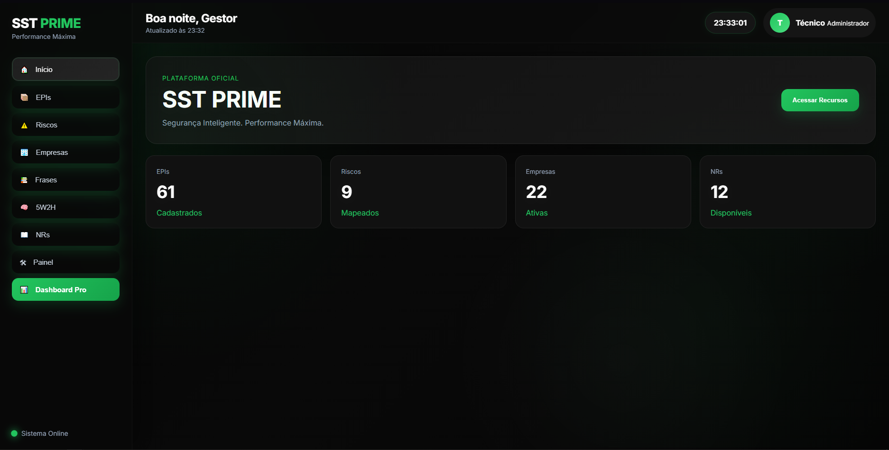

# 🚀 SST PRIME

Plataforma premium de Segurança do Trabalho desenvolvida com foco em performance, organização e experiência visual moderna.

---

## 💎 Destaques

✅ Dashboard inteligente  
✅ Gestão de EPIs  
✅ Busca dinâmica  
✅ Filtros premium  
✅ Painel com documentos  
✅ Gerador de frases  
✅ Interface SaaS moderna  
✅ 100% responsivo

---

## 🖥 Preview

---

## 🌐 Acesse Online

[🔗 Abrir Sistema](https://vytorvilar.github.io/sst-prime/)

---

## ⚙️ Tecnologias

- HTML5
- CSS3
- JavaScript
- Chart.js

---

## 🎯 Objetivo

Centralizar rotinas de SST em uma plataforma moderna, elegante e funcional.

---

## 👑 Autor

Desenvolvido por Vytor Vilar
